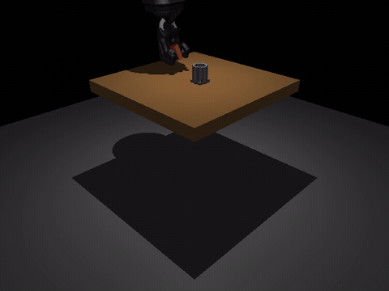
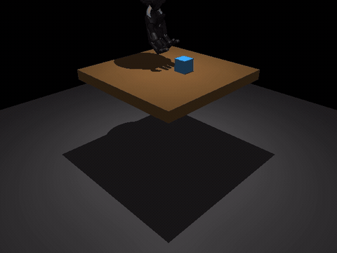
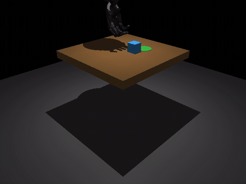

# Dexterous Hand RL

A simulated 24-DoF Shadow Hand trained with PPO on MuJoCo 3 / MJX to solve three
manipulation tasks: grasping a cube, pick-and-place to a randomized goal, and peg-in-hole
insertion.



## Setup

```bash
git clone https://github.com/AryaPeer/shadowhand-rl.git
cd shadowhand-rl
uv sync --extra mjx
```

```bash
uv run python -c "import jax; print(jax.devices())"
```

## Train

```bash
uv run python main.py train-grasp-mjx     --num-envs 768 --total-timesteps 70000000
uv run python main.py train-peg-mjx       --num-envs 768 --total-timesteps 50000000
uv run python main.py train-pickplace-mjx --num-envs 768 --total-timesteps 70000000
```

Runs stop themselves at 10M/30M/40M if metrics stall. Pass `--no-gate` to disable.
Output goes to `runs/<name>/`, with checkpoints every 500k steps.

## Resume

```bash
uv run python main.py resume-peg-mjx \
    --model-path runs/<name>/final_model.zip \
    --vec-normalize-path runs/<name>/vec_normalize.pkl \
    --additional-timesteps 50000000 --num-envs 768
```

## Render

```bash
uv run python scripts/render_policy_rollout.py --task peg \
    --peg-model runs/<name>/final_model.zip \
    --peg-vec-normalize runs/<name>/vec_normalize.pkl \
    --out-dir demos --tail-steps 15
```

## Evaluate

```bash
uv run python scripts/eval_policy.py --task peg \
    --model-path runs/<name>/final_model.zip \
    --vec-normalize-path runs/<name>/vec_normalize.pkl --episodes 64
```

## Test

```bash
uv run pytest
uv run pytest -m peg
uv run pytest -m "peg and not slow"
```

## Results

Grasp: pick a cube off the table and hold it at height.



Pick-and-place: carry a cube to a random goal and place it inside the bounds.



Peg-in-hole: align a peg over a hole and release it.


## Notes

The Shadow Hand MJCF model comes from the
[MuJoCo Menagerie](https://github.com/google-deepmind/mujoco_menagerie).
